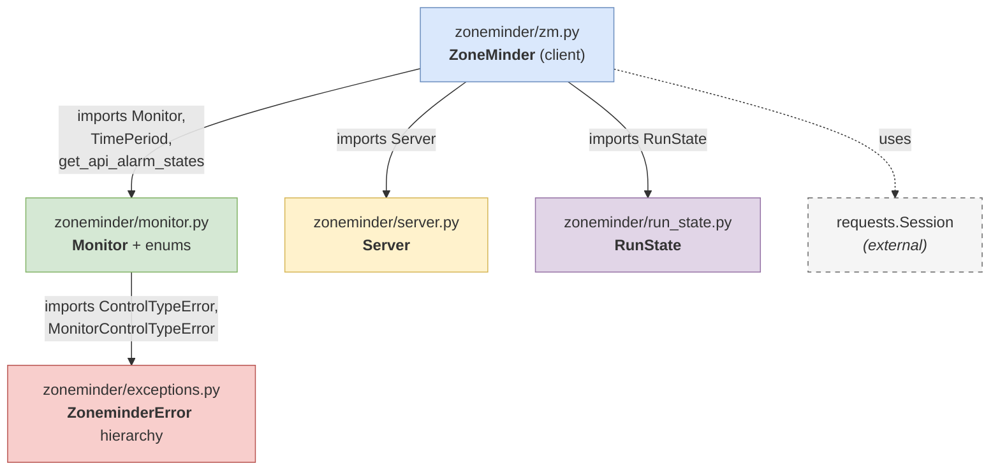
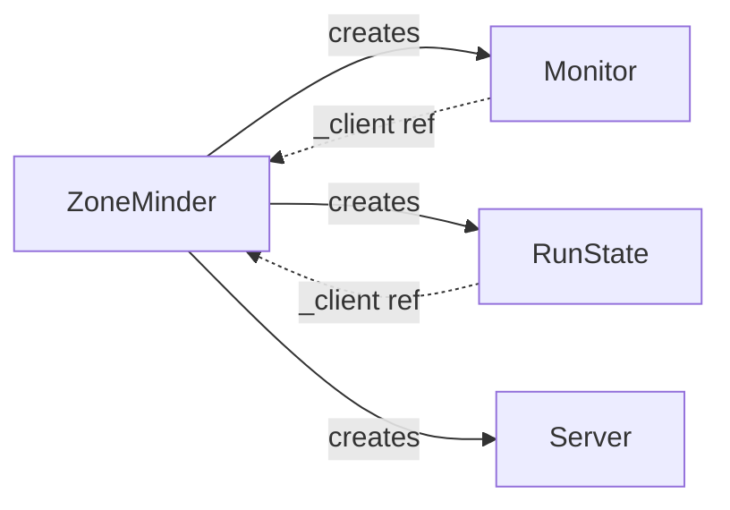
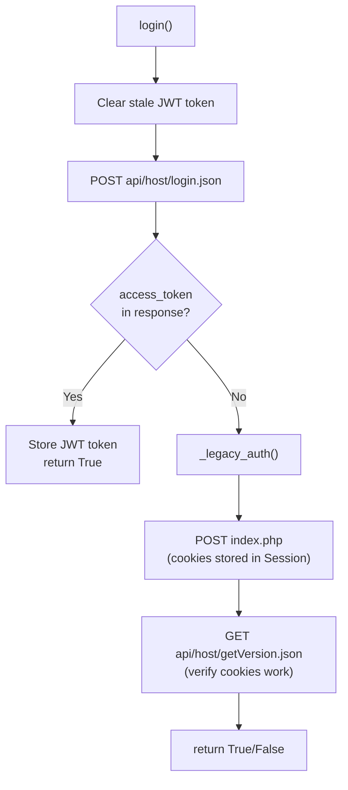
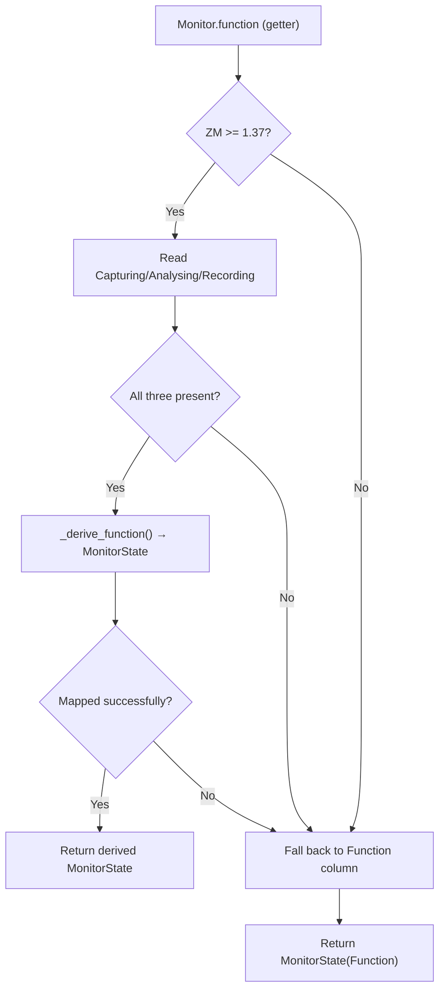
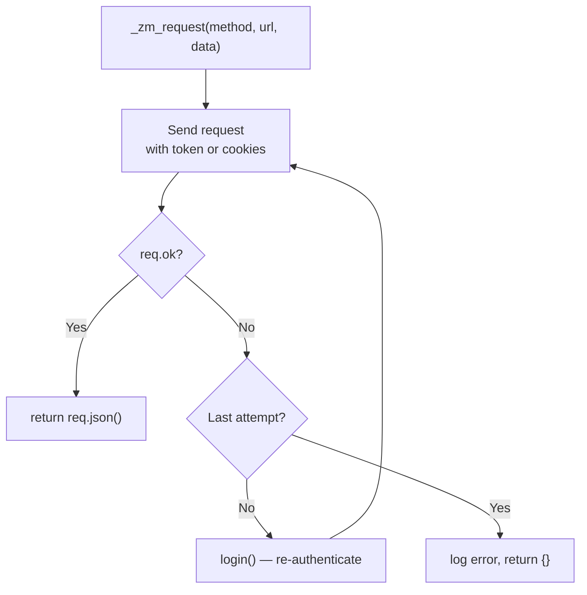

# zm-py Architecture

Companion document to the [drawio diagrams](architecture.drawio) with Mermaid diagrams
that render directly on GitHub.

## Package Structure

zm-py is organized into 5 modules under the `zoneminder/` package:

## Key Design Patterns

### Client-based construction

`Monitor` and `RunState` hold a reference to the `ZoneMinder` client so they can make
API calls on demand (lazy properties like `is_recording`, `active`). `Server` objects
are standalone but are fetched and cached through the client.

### Defensive error handling

Most API errors return empty dict (`{}`) or `None` rather than raising exceptions.
Callers must check for falsy values. Exceptions are reserved for programming errors
(e.g. `ControlTypeError` for invalid PTZ directions, `MonitorControlTypeError` for
PTZ on non-controllable monitors).

### Dual auth

JWT authentication (ZM 1.30+) with automatic fallback to legacy session cookies:

Stale JWT tokens are cleared before re-auth to prevent 401s when falling back
to cookie auth (the session would send both the stale `?token=` and valid cookies,
and ZM rejects the stale token).

### Version-aware monitor fields

On ZM >= 1.37, the single `Function` column was decomposed into three independent
columns: `Capturing`, `Analysing`, `Recording`. zm-py detects the server version
and reads/writes the appropriate fields:

### Request retry with re-auth

## Caching Strategy

zm-py uses time-based caching (`time.monotonic()`) to reduce API calls within
Home Assistant's polling cycle:

| What | TTL | Invalidation | Location |
|------|-----|-------------|----------|
| `Monitor.update_monitor()` | 1 second | `function` setter sets `_last_update = 0.0` | `monitor.py` |
| `ZoneMinder.get_event_counts()` | 1 second | Natural expiry | `zm.py` |
| `RunState.active` | 1 second | Natural expiry | `run_state.py` |
| `ZoneMinder._alarm_states` | Login lifetime | Recalculated on each `login()` | `zm.py` |
| `ZoneMinder._servers` | Client lifetime | Lazy-fetched once, never refreshed | `zm.py` |

The 1-second TTL is designed for Home Assistant's typical 10-30 second polling
interval. Within a single poll cycle, HA accesses each monitor's properties
multiple times (function, is_available, events, etc.) across sensor, switch, and
camera entities. The cache ensures each API endpoint is hit at most once per cycle.

## Detailed Diagrams

For detailed visual diagrams, open the drawio files in [draw.io](https://app.diagrams.net/):

- **[architecture.drawio](architecture.drawio)** — Package architecture, class relationships, auth flow, multi-server URL routing (4 pages)
- **[api-overview.drawio](api-overview.drawio)** — API endpoints grid, monitor state model (2 pages)
